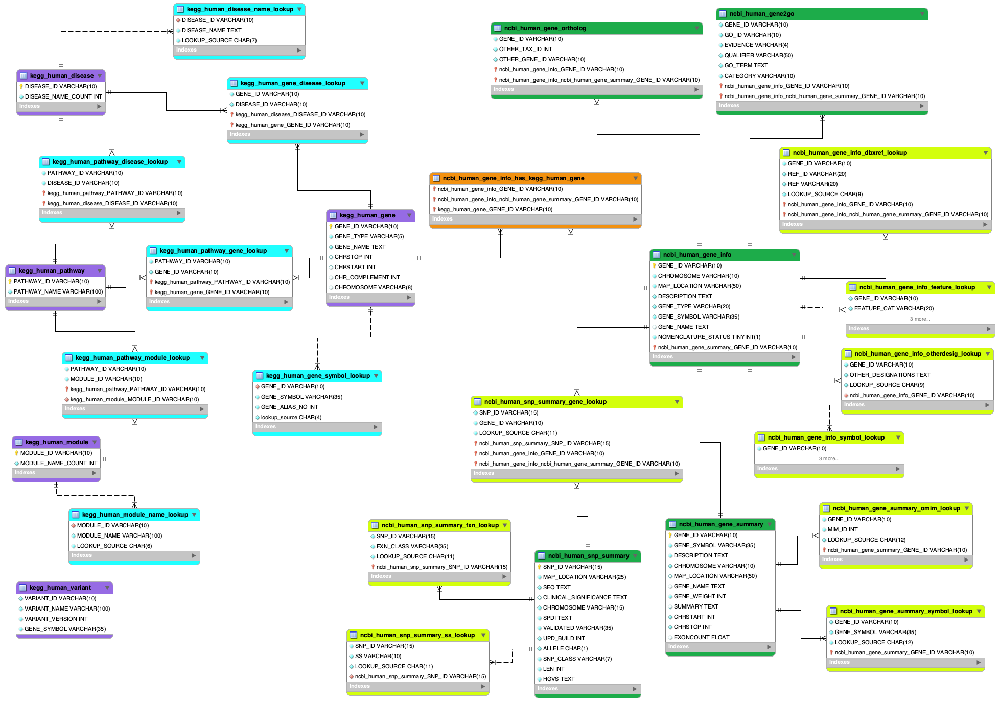

# Human Genome Database
Repository for data pipeline that will build & update the Human Genome (Analytics) Database

*Note: As of 01/2024, this genomics-data extraction & processing pipeline is still under construction*

## 1. Overview
Welcome to the Human Genome Database! The primary purpose of this repository is to develop a pipeline that enables efficient extraction of public genomic data for big-data anlytics. This pipeline aims to solve the challenges of extracting & processing data from public resources like NCBI, Kegg & other genomics-data holder.

### 1a. Purpose
WThese primary challenges that HGD aims to solve are the following:

| Challenge | Explanation    | HGD Pipeline Advantage |
| ----------| -------------- | ----------------------- |
| Difficult-to-manage scale of data | Each database encompasses massively wide varieties of data types across many different organisms. This creates massive volumes of data that must be queried | HGD efficiently extracts, processes & stores *human* genomics data | 
| Data separation & inconsistency | Many of the data sources contain subsets of genomics data, and each formatted in a particular way. This makes it difficult to query one in the same manner as another, when data is missing from one. Even with cross-DB references, the labeling-styles & patterns are inconsistent & take time to understand | HGD links data across sources, and standardizes naming patterns & schemas to elimintate confusion & speed up cross-DB referencing | 
| Complex data-content relations | Even within a data source, relatonships are not directly obvious and take a great deal of repetitive extraction & processing to link and understand, thus slowing down research | HGD standardizes & normalizes data into a *relational* database to make relationships abundantly clear & very simple to query |

### 1b. Source Pipelines
There are currently 2 supported pipelines and a 3rd in progress. 

Supported data-source pipelines:
- NCBI (SNP & Gene) = "source_pipes/ncbi_pipe"
- Kegg (Gene, Pathway, Disease, Module, Variant) = "source_pipes/kegg_pipe"

Soon to come:
- Reactome (Pathway)

<br>

### 1c. Source Connectivity & Lookups

**Key**
- Purple: Kegg Datasets (gene, pathway, disease, etc.)
- Blue: Lookup tables for Kegg objects (normalization of Object details such as aliases)
- Green: NCBI Datasets (Gene summary, SNP summary, etc.)
- Yellow: Lookup tables for NCBI objects (normalization of Object details such as aliases)
- Orange: Connection detail demonstrating link between Kegg & NCBI (all can be connected via Genes)
<br>
<br>



### Data-Source Acquisition
Below represents a list of currently supported data sources, each with their own respective pipeline. 
Each pipeline has a set of databases that is a sub-section of those from the original genomic source.


| Source    | Database Name  | HGD db_table Name | Extraction Method | Source Link                                                                         |
| ----------| -------------- | ----------------- | ----------------- | ------------------------------------------------------------------------------------
| NCBI      | gene_info      | gene_info         | NCBI FTP          | https://ftp.ncbi.nlm.nih.gov/gene/DATA/GENE_INFO/Mammalia/Homo_sapiens.gene_info.gz |
| NCBI      | gene_orthologs | gene_orthologs    | NCBI FTP          | https://ftp.ncbi.nlm.nih.gov/gene/DATA/gene_orthologs.gz |
| NCBI      | gene2go        | gene2go           | NCBI FTP          | https://ftp.ncbi.nlm.nih.gov/gene/DATA/gene2go.gz |
| NCBI      | gene           | gene_summary      | Entrez/Biopython  | https://www.ncbi.nlm.nih.gov/gene/ |
| NCBI      | snp (dbSNP)    | snp_summary       | Entrez/Biopython  | https://www.ncbi.nlm.nih.gov/snp/ |
| Kegg      | pathway        | pathway           | Kegg API          | https://rest.kegg.jp/list/pathway/hsa/ |
| Kegg      | gene (hsa)     | gene              | Kegg API          | https://rest.kegg.jp/list/hsa/ |
| Kegg      | disease        | disease           | Kegg API          | https://rest.kegg.jp/list/disease/ |
| Kegg      | variant        | variant           | Kegg API          | https://rest.kegg.jp/list/variant/ |
| Kegg      | module         | module            | Kegg API          | https://rest.kegg.jp/list/module/ |


## 2. Usage

### 2a. Building The Database

#### 2a.1. Recreating Database - Using the dump
If you would like to re-create the MySQL database from a backup dump, follow the instructions below.
Note: This is the easiest method, but will result in static data. The pipeline is scheduled to run weekly & upload new dump to 
Github weekly.

Option 1: Initialize Pipeline & Execute Query-file

```
import humangenomedatabase.hgd_pipe as hgdp
hgd_pipeline = hgdp.humanGenomeDataPipe(pipetype='database')

# Structure only
hgd_pipeline.create_database(structure_only=True)

# Full database load with structure & saved data
hgd_pipeline.create_database()
```

Option 2: Load Database From Command-Line

```
# To create database: Start MySQL & sign in
$ mysql -u root -p
    > enter password

# Create database if you haven't already
mysql> CREATE DATABASE human_genome_database;
mysql \q

# Load data from sql-file
$ mysql -p -u [user] human_genome_database < hgd_database.sql
```


#### 2a.2.. Recreating Database - Running the pipeline
If you would like to re-create the MySQL database by running the pipeline yourself, follow the instructions below.
Note: This is a trickier method, but will allow you to create your own database & refresh when you want to 

```
# Run 'refresh.py', or use code in your own py-file:
# Initialize pipeline & iterate over sources
for pipetype in ['kegg','ncbi']:
    hgd_pipeline = hgdp.humanGenomeDataPipe(pipetype=pipetype)
    hgd_pipeline.auto_extract = True
    hgd_pipeline.hgd_table_refresh()
```


#### 2a.3. Pulling & Exploring Data without Database
If you are a data scientist, analyst, researcher, or anyone who wants to explore this Human Genome data, follow the steps below
to pull the data locally into your environment


# 3. Roadmap

## 3a. In Brief
- Additional Sources
    - NCBI 
    - Kegg
    - Reactome
        - Pathways
- Pipeline
    - Incremental load (updated records only)

## 3b. Known Issues
- The SNP-summary data extraction process times out & errors often due to NCBI server limitations. Work is in progress to ensure this component can be run without server failure
